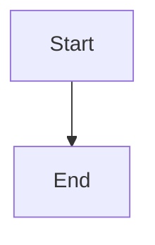
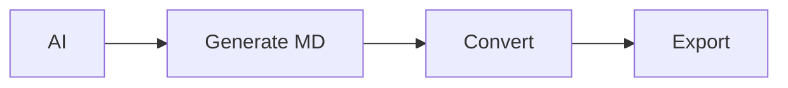

# AI Agent Integration Guide

This guide explains how AI agents can use the MD Converter to export documents.

## Overview

The MD Converter is a client-side web application that converts Markdown to DOCX, PDF, or HTML while preserving Mermaid diagrams. It runs entirely in the browser with no server-side processing.

## Integration Approaches

### Approach 1: Browser Automation (Recommended)

Use browser automation tools like Puppeteer, Playwright, or Selenium to interact with the web interface.

#### Example with Playwright (Node.js)

```javascript
const { chromium } = require('playwright');

async function convertMarkdown(markdownContent, outputFormat = 'docx', fileName = 'document') {
    const browser = await chromium.launch();
    const page = await browser.newPage();
    
    // Navigate to the app
    await page.goto('http://localhost:5008');
    
    // Wait for the app to load
    await page.waitForSelector('#markdownInput');
    
    // Paste markdown content
    await page.fill('#markdownInput', markdownContent);
    
    // Select output format
    if (outputFormat === 'pdf') {
        await page.click('#formatPdf');
    } else if (outputFormat === 'html') {
        await page.click('#formatHtml');
    } else {
        await page.click('#formatDocx');
    }
    
    // Set filename
    await page.fill('input[type="text"]', fileName);
    
    // Set up download listener
    const [download] = await Promise.all([
        page.waitForEvent('download'),
        page.click('button:has-text("Convert & Download")')
    ]);
    
    // Save the file
    await download.saveAs(`./output/${fileName}.${outputFormat}`);
    
    await browser.close();
}

// Usage
convertMarkdown(`
# My Document

## System Flow

\`\`\`mermaid
graph TD
    A[Start] --> B[Process]
    B --> C[End]
\`\`\`
`, 'pdf', 'system-flow');
```

#### Example with Python + Selenium

```python
from selenium import webdriver
from selenium.webdriver.common.by import By
from selenium.webdriver.support.ui import WebDriverWait
from selenium.webdriver.support import expected_conditions as EC
import time

def convert_markdown(markdown_content, output_format='docx', file_name='document'):
    # Set up Chrome options for download
    options = webdriver.ChromeOptions()
    prefs = {
        "download.default_directory": "./output",
        "download.prompt_for_download": False,
    }
    options.add_experimental_option("prefs", prefs)
    
    driver = webdriver.Chrome(options=options)
    
    try:
        # Navigate to the app
        driver.get('http://localhost:5008')
        
        # Wait for the textarea to be present
        textarea = WebDriverWait(driver, 10).until(
            EC.presence_of_element_located((By.ID, "markdownInput"))
        )
        
        # Clear and input markdown
        textarea.clear()
        textarea.send_keys(markdown_content)
        
        # Select format
        format_map = {
            'docx': 'formatDocx',
            'pdf': 'formatPdf',
            'html': 'formatHtml'
        }
        format_radio = driver.find_element(By.ID, format_map.get(output_format, 'formatDocx'))
        format_radio.click()
        
        # Set filename
        filename_input = driver.find_element(By.CSS_SELECTOR, 'input[type="text"]')
        filename_input.clear()
        filename_input.send_keys(file_name)
        
        # Click convert button
        convert_button = driver.find_element(By.XPATH, "//button[contains(text(), 'Convert & Download')]")
        convert_button.click()
        
        # Wait for download to complete
        time.sleep(5)
        
    finally:
        driver.quit()

# Usage
markdown = """
# Project Report

## Architecture


"""

convert_markdown(markdown, 'pdf', 'project-report')
```

### Approach 2: Direct File Upload

If you have markdown files, you can automate the file upload:

```javascript
// Playwright example
const fileInput = await page.locator('input[type="file"]');
await fileInput.setInputFiles('./my-document.md');

// Wait for file to be loaded
await page.waitForSelector('text=loaded successfully');

// Select format and convert
await page.click('#formatPdf');
await page.click('button:has-text("Convert & Download")');
```

### Approach 3: API-Style Integration (Future)

For a more programmatic approach, you could extend the application with a REST API endpoint or use the browser's DevTools Protocol.

## Markdown Format Requirements

### Supported Markdown Features

1. **Headers**: `# H1` through `###### H6`
2. **Text Formatting**: 
   - Bold: `**text**` or `__text__`
   - Italic: `*text*` or `_text_`
   - Code: `` `code` ``
3. **Lists**:
   - Unordered: `- item` or `* item`
   - Ordered: `1. item`
4. **Code Blocks**:
   ````markdown
   ```language
   code here
   ```
   ````
5. **Tables**:
   ```markdown
   | Column 1 | Column 2 |
   |----------|----------|
   | Data     | Data     |
   ```
6. **Links**: `[text](url)`
7. **Blockquotes**: `> quote`

### Mermaid Diagram Format

Mermaid diagrams must be in fenced code blocks with `mermaid` language identifier:

````markdown

````

Supported diagram types:
- Flowcharts (`graph` or `flowchart`)
- Sequence diagrams (`sequenceDiagram`)
- Class diagrams (`classDiagram`)
- State diagrams (`stateDiagram-v2`)
- Entity Relationship (`erDiagram`)
- Gantt charts (`gantt`)
- Pie charts (`pie`)
- And more...

## Output Formats

### DOCX (Microsoft Word)
- **Extension**: `.docx`
- **MIME Type**: `application/vnd.openxmlformats-officedocument.wordprocessingml.document`
- **Features**: Full formatting, tables, diagrams as placeholders
- **Use Case**: Editable documents, corporate reports

### PDF
- **Extension**: `.pdf`
- **MIME Type**: `application/pdf`
- **Features**: Fixed layout, diagrams as text placeholders
- **Use Case**: Distribution, printing, archival

### HTML
- **Extension**: `.html`
- **MIME Type**: `text/html`
- **Features**: Full styling, embedded SVG diagrams, responsive
- **Use Case**: Web publishing, previews

## Error Handling

The application provides feedback through status messages:

```javascript
// Wait for success or error message
const statusMessage = await page.locator('.alert').textContent();

if (statusMessage.includes('Successfully')) {
    console.log('Conversion successful');
} else {
    console.error('Conversion failed:', statusMessage);
}
```

Common errors:
- Empty markdown content
- Invalid Mermaid syntax (diagram may be skipped)
- Browser limitations (very large files)

## Performance Considerations

- **File Size**: Tested up to 10MB markdown files
- **Diagram Count**: No practical limit, but more diagrams = longer processing
- **Conversion Time**: 
  - DOCX: 1-3 seconds
  - PDF: 2-5 seconds
  - HTML: < 1 second

## Example: Complete AI Agent Workflow

```python
import requests
from selenium import webdriver
from pathlib import Path

class MarkdownConverter:
    def __init__(self, app_url='http://localhost:5008'):
        self.app_url = app_url
        self.driver = None
    
    def setup(self):
        """Initialize browser"""
        options = webdriver.ChromeOptions()
        options.add_argument('--headless')  # Run in background
        self.driver = webdriver.Chrome(options=options)
    
    def convert(self, markdown_text, format='docx', output_path='output'):
        """Convert markdown to specified format"""
        self.driver.get(self.app_url)
        
        # Input markdown
        textarea = self.driver.find_element('id', 'markdownInput')
        textarea.clear()
        textarea.send_keys(markdown_text)
        
        # Select format
        format_id = f'format{format.capitalize()}'
        self.driver.find_element('id', format_id).click()
        
        # Convert
        self.driver.find_element('xpath', 
            "//button[contains(text(), 'Convert')]").click()
        
        # Wait for download
        import time
        time.sleep(3)
        
        return True
    
    def cleanup(self):
        """Close browser"""
        if self.driver:
            self.driver.quit()

# Usage
converter = MarkdownConverter()
converter.setup()

# Generate markdown with AI
ai_generated_markdown = """
# AI Generated Report

## Summary
This report was automatically generated.

## Process Flow

"""

converter.convert(ai_generated_markdown, format='pdf')
converter.cleanup()
```

## Deployment for AI Agents

### Local Deployment
```bash
cd MD-conversion-tool
dotnet run
# App available at http://localhost:5008
```

### Docker Deployment
```dockerfile
FROM mcr.microsoft.com/dotnet/sdk:9.0 AS build
WORKDIR /src
COPY . .
RUN dotnet publish -c Release -o /app

FROM nginx:alpine
COPY --from=build /app/wwwroot /usr/share/nginx/html
EXPOSE 80
```

### Cloud Deployment
Deploy to static hosting:
- Azure Static Web Apps
- Netlify
- Vercel
- GitHub Pages

## Security Considerations

- All processing happens client-side
- No data sent to external servers
- Safe for sensitive documents
- Consider running in isolated browser instance

## Troubleshooting

### Browser Compatibility
- Chrome/Edge: ✅ Full support
- Firefox: ✅ Full support
- Safari: ✅ Full support

### Common Issues

1. **Download not starting**: Ensure download folder permissions
2. **Mermaid not rendering**: Check syntax with [Mermaid Live Editor](https://mermaid.live)
3. **Conversion fails**: Check browser console for errors

## Advanced Usage

### Batch Conversion

```javascript
async function convertBatch(markdownFiles) {
    const browser = await chromium.launch();
    const page = await browser.newPage();
    
    for (const file of markdownFiles) {
        const content = await fs.readFile(file, 'utf-8');
        await convertMarkdown(page, content, 'pdf', path.basename(file, '.md'));
    }
    
    await browser.close();
}
```

### Custom Styling

Modify the generated HTML by intercepting the download:

```javascript
const download = await page.waitForEvent('download');
const buffer = await download.createReadStream();
// Modify buffer contents
// Save custom version
```

## Support

For issues or questions:
1. Check the browser console for errors
2. Verify markdown syntax
3. Test with sample document
4. Review application logs

---

*This integration guide is maintained alongside the MD Converter application.*
