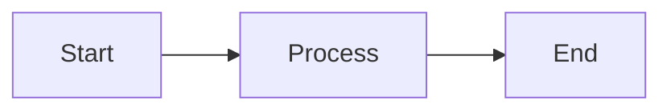

# Presentation Format Support

## Overview
The MD Converter now supports three presentation formats in addition to document formats:

### Document Formats
- ✅ **DOCX** - Microsoft Word documents
- ✅ **PDF** - Via browser print dialog
- ✅ **HTML** - Standalone web pages

### Presentation Formats (NEW!)
- 🎬 **PPTX** - PowerPoint presentations
- 🎓 **Beamer** - LaTeX presentation slides (academic)
- 💻 **Reveal.js** - Interactive HTML presentations

## How It Works

### Slide Structure
When converting markdown to presentation formats, the converter uses headings to define slides:

```markdown
# Main Title Slide
This becomes the first slide

## Content Slide
This becomes a separate slide with "Content Slide" as the title

### Bullet Points
- Point 1
- Point 2
- Point 3
```

### Image Handling
- **PPTX & Beamer**: Mermaid diagrams and SVGs are converted to PNG for compatibility
- **Reveal.js**: Supports SVG for better quality vector graphics

## Format Details

### PowerPoint (PPTX)
- **File Extension**: `.pptx`
- **MIME Type**: `application/vnd.openxmlformats-officedocument.presentationml.presentation`
- **Best For**: Business presentations, editing in PowerPoint or Google Slides
- **Features**: 
  - Each `#` or `##` heading becomes a slide
  - Supports images, tables, lists
  - Fully editable in PowerPoint

### Beamer (LaTeX)
- **File Extension**: `.tex`
- **MIME Type**: `application/x-latex`
- **Best For**: Academic presentations, research talks
- **Features**:
  - LaTeX-based professional typesetting
  - Mathematical formulas support
  - Requires LaTeX processor to compile to PDF
  - Standard format in academia

### Reveal.js
- **File Extension**: `.html`
- **MIME Type**: `text/html`
- **Best For**: Interactive web presentations, tech talks
- **Features**:
  - Opens directly in browser
  - Arrow key navigation
  - Supports speaker notes
  - Themes and transitions
  - Can be hosted on any web server

## Implementation

### Services Updated
- **PandocService.cs**: Added three new methods
  - `ConvertMarkdownToPptxAsync()`
  - `ConvertMarkdownToBeamerAsync()`
  - `ConvertMarkdownToRevealJsAsync()`

### JavaScript Updates
- **pandoc-interop.js**: Added three new Pandoc WASM functions
  - `convertMarkdownToPptx()`
  - `convertMarkdownToBeamer()`
  - `convertMarkdownToRevealJs()`

### UI Changes
- **Home.razor**: 
  - Reorganized output format selector into Documents and Presentations sections
  - Added format descriptions for each presentation type
  - Updated About modal with presentation information
  - Updated Features list

## Usage Tips

1. **Slide Titles**: Use `#` or `##` for slide titles
2. **Content**: Place slide content after headings
3. **Images**: Mermaid diagrams automatically converted to PNG for PPTX/Beamer
4. **Lists**: Bullet points and numbered lists work great in all formats
5. **Code Blocks**: Supported in all presentation formats

## Example Presentation Markdown

```markdown
# My Presentation Title
By Your Name

---

## Introduction
- Point 1
- Point 2
- Point 3

---

## Diagram Example



---

## Conclusion
Thank you!
```

## Technical Notes

- All conversion happens client-side via Pandoc WASM
- No server required - complete privacy
- PNG conversion for diagrams ensures maximum compatibility
- Reveal.js output is standalone HTML (no CDN dependencies with `--standalone` flag)
