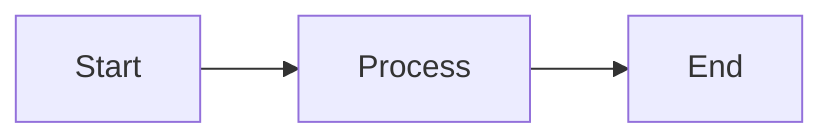
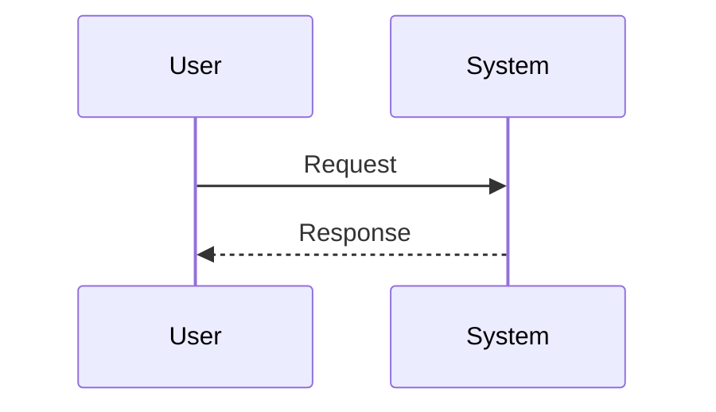
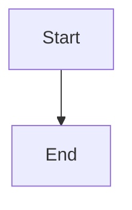

# MD Converter - Quick Reference

## 🚀 Quick Start

```bash
# Clone/Navigate to project
cd MD-conversion-tool

# Run application
dotnet run

# Open browser
# Navigate to: http://localhost:5008
```

## 📋 Common Commands

| Task | Command |
|------|---------|
| Build | `dotnet build` |
| Run | `dotnet run` |
| Publish | `dotnet publish -c Release` |
| Test | `./test.sh` |
| Clean | `dotnet clean` |
| Restore packages | `dotnet restore` |

## 🎯 Supported Markdown Syntax

| Element | Syntax | Output Format Support |
|---------|--------|----------------------|
| H1 | `# Heading` | DOCX, PDF, HTML |
| H2-H6 | `## Heading` | DOCX, PDF, HTML |
| Bold | `**text**` | DOCX, PDF, HTML |
| Italic | `*text*` | DOCX, PDF, HTML |
| Code | `` `code` `` | DOCX, PDF, HTML |
| Code Block | ` ```lang\ncode\n``` ` | DOCX, PDF, HTML |
| Link | `[text](url)` | DOCX, PDF, HTML |
| Table | `\| Col \| Col \|` | DOCX, PDF, HTML |
| Unordered List | `- item` | DOCX, PDF, HTML |
| Ordered List | `1. item` | DOCX, PDF, HTML |
| Blockquote | `> quote` | DOCX, PDF, HTML |
| Mermaid | ` ```mermaid\ncode\n``` ` | DOCX, PDF, HTML |

## 🎨 Mermaid Diagram Types

| Type | Syntax Start | Example |
|------|-------------|---------|
| Flowchart | `graph TD` or `flowchart LR` | Process flows |
| Sequence | `sequenceDiagram` | Interactions |
| Class | `classDiagram` | UML classes |
| State | `stateDiagram-v2` | State machines |
| ER | `erDiagram` | Database schemas |
| Gantt | `gantt` | Project timelines |
| Pie | `pie` | Data distribution |
| Git Graph | `gitGraph` | Git workflows |

## 📦 Output Formats

| Format | Extension | MIME Type | Best For |
|--------|-----------|-----------|----------|
| Word | `.docx` | `application/vnd.openxmlformats-officedocument.wordprocessingml.document` | Editing |
| PDF | `.pdf` | `application/pdf` | Sharing |
| HTML | `.html` | `text/html` | Web |

## 🔧 Key Services

| Service | Purpose | Method |
|---------|---------|--------|
| MarkdownParser | Parse MD | `ParseMarkdown(string)` |
| MermaidService | Render diagrams | `RenderAllDiagrams(List)` |
| DocxConverter | Generate DOCX | `ConvertToDocx(html, diagrams)` |
| PdfConverter | Generate PDF | `ConvertToPdf(html, diagrams)` |

## 💻 Browser Automation (AI Agents)

### Playwright (JavaScript)

```javascript
await page.goto('http://localhost:5008');
await page.fill('#markdownInput', markdown);
await page.click('#formatPdf');
await page.click('button:has-text("Convert & Download")');
```

### Selenium (Python)

```python
driver.get('http://localhost:5008')
driver.find_element(By.ID, 'markdownInput').send_keys(markdown)
driver.find_element(By.ID, 'formatDocx').click()
driver.find_element(By.XPATH, "//button[contains(text(), 'Convert')]").click()
```

## 🎛️ Configuration

### Mermaid Theme (wwwroot/js/mermaid-interop.js)

```javascript
mermaid.initialize({ 
    theme: 'default', // Options: default, dark, forest, neutral
});
```

### File Size Limit (Pages/Home.razor)

```csharp
file.OpenReadStream(maxAllowedSize: 10 * 1024 * 1024) // 10MB
```

## 📁 Project Structure

```
MD-conversion-tool/
├── Models/              # Data models
├── Services/            # Business logic
├── Pages/               # Razor components
├── wwwroot/            # Static files
│   ├── js/             # JavaScript
│   └── css/            # Styles
├── Program.cs          # Entry point
└── *.md                # Documentation
```

## 🐛 Common Issues & Solutions

| Issue | Solution |
|-------|----------|
| Mermaid not rendering | Check syntax at mermaid.live |
| Download not starting | Check browser permissions |
| Build fails | Run `dotnet restore` |
| Port already in use | Change in launchSettings.json |
| Large file slow | Optimize markdown size |

## 📊 Performance Tips

| Optimization | Impact |
|--------------|--------|
| Reduce diagram complexity | High |
| Use compressed images | Medium |
| Minimize markdown size | Medium |
| Close other apps | Low |

## 🔍 Debugging

### Browser Console

```javascript
// Check if Mermaid loaded
console.log(typeof mermaid);

// Test rendering
await renderMermaid('graph TD\n A-->B', 'test');
```

### .NET Logging

```csharp
// Add to any service
Console.WriteLine($"Converting: {format}");
```

## 📖 Example Snippets

### Simple Flowchart

````markdown

````

### Sequence Diagram

````markdown

````

### Table

```markdown
| Feature | Supported |
|---------|-----------|
| DOCX    | ✅        |
| PDF     | ✅        |
| HTML    | ✅        |
```

## 🚢 Deployment Checklist

- [ ] Run `dotnet publish -c Release`
- [ ] Test output in `bin/Release/net9.0/publish/wwwroot/`
- [ ] Update `<base href>` in index.html if needed
- [ ] Upload to hosting service
- [ ] Test all formats
- [ ] Verify Mermaid renders

## 📞 Support Resources

| Resource | Location |
|----------|----------|
| Full docs | README.md |
| AI integration | AI-AGENT-GUIDE.md |
| Architecture | ARCHITECTURE.md |
| Project summary | PROJECT-SUMMARY.md |
| Sample file | sample-document.md |

## ⌨️ Keyboard Shortcuts (Browser)

| Action | Shortcut |
|--------|----------|
| Clear text | Cmd/Ctrl + A, Delete |
| Focus textarea | Tab |
| Submit | Enter (in filename) |

## 🎓 Learning Resources

- [Blazor Docs](https://learn.microsoft.com/aspnet/core/blazor/)
- [Markdig](https://github.com/xoofx/markdig)
- [QuestPDF](https://www.questpdf.com/)
- [Open XML SDK](https://learn.microsoft.com/office/open-xml/word-processing)
- [Mermaid](https://mermaid.js.org/)

## 📝 Template: Basic Document

```markdown
# Document Title

## Introduction
Your introduction here.

## Diagram



## Conclusion
Your conclusion here.
```

## 🔗 Quick Links

- Mermaid Live Editor: https://mermaid.live
- Bootstrap Icons: https://icons.getbootstrap.com
- .NET Download: https://dotnet.microsoft.com/download

---

**Version**: 1.0
**Last Updated**: October 2025
**Status**: ✅ Production Ready
