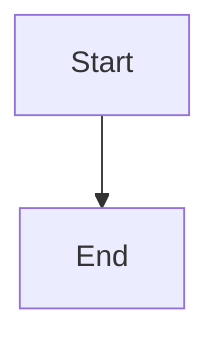
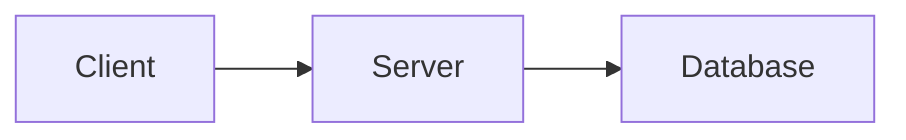

# SVG Handling in MD Converter

## Overview

The MD Converter now intelligently handles SVG files and embedded SVG content in your markdown documents with format-specific optimizations.

## SVG Source Types Supported

### 1. **External SVG File References**
```markdown


```

### 2. **Embedded SVG Code**
```markdown
<svg width="100" height="100">
  <circle cx="50" cy="50" r="40" fill="blue"/>
</svg>
```

### 3. **Mermaid Diagrams** (Already Supported)
```markdown

```

## Processing Strategy (Hybrid Approach)

### For **DOCX** Output:
- ✅ **Mermaid diagrams** → Rendered to SVG → **Converted to PNG** → Embedded as data URIs
- ✅ **External SVG files** → **Converted to PNG** → Embedded as data URIs
- ✅ **Embedded SVG** → **Converted to PNG** → Embedded as data URIs
- **Why PNG?** Maximum compatibility with Microsoft Word and other DOCX readers

### For **PDF** Output (via Print):
- ✅ **Mermaid diagrams** → **Converted to PNG** → Embedded in HTML
- ✅ **SVG files** → **Converted to PNG** → Embedded in HTML
- **Why PNG?** Ensures consistent rendering across all PDF viewers and printers

### For **HTML** Output:
- ✅ **Mermaid diagrams** → **Kept as SVG** data URIs (vector quality preserved)
- ✅ **SVG files** → **Kept as SVG** data URIs (vector quality preserved)
- ✅ **Embedded SVG** → **Kept as SVG** data URIs
- **Why SVG?** Best quality for web viewing, scalable, smaller file size

## Implementation Details

### SvgHandler Service (`Services/SvgHandler.cs`)

**Key Methods:**
1. `ExtractSvgReferencesAsync(markdown)` - Finds all SVG references in markdown
2. `ConvertSvgToPngAsync(svgContent)` - Converts SVG to PNG using browser canvas
3. `ProcessSvgReferencesAsync(markdown, svgRefs, convertToPng)` - Replaces SVG refs with appropriate format

**What it does:**
- Scans markdown for `` patterns
- Scans for embedded `<svg>...</svg>` tags
- Converts to PNG when needed for DOCX/PDF compatibility
- Embeds as data URIs for HTML quality

### Conversion Workflow

The conversion now follows these steps:

1. **Step 1/6:** Extract Mermaid diagrams + SVG references
2. **Step 2/6:** Render Mermaid diagrams to SVG
3. **Step 3/6:** Convert Mermaid to PNG (DOCX/PDF) or keep SVG (HTML)
4. **Step 4/6:** Process SVG references (convert/embed based on output format)
5. **Step 5/6:** Update markdown with image references
6. **Step 6/6:** Generate final document with Pandoc WASM

## Handling External SVG Files

### Current Limitation
If your markdown references **external SVG files** that don't exist in the browser (e.g., `assets/diagram.svg`), the converter will:
- ⚠️ Log a warning: `"Keeping external SVG reference: assets/diagram.svg"`
- ⚠️ Pandoc will warn: `"Could not fetch resource assets/diagram.svg"`
- 📝 The reference will remain in the markdown (Pandoc replaces with description text)

### Future Enhancement Options
To fully support external SVG files, we could:
1. **Allow file upload** - Let users upload referenced SVG files alongside markdown
2. **Fetch from URLs** - If SVG path is a URL, download and process it
3. **Scan project folders** - Check `wwwroot/assets/` for matching files
4. **Inline SVG extraction** - Parse uploaded markdown ZIP with assets

## Best Practices

### ✅ Recommended: Use Mermaid for Diagrams
```markdown

```
**Why?** Fully supported, automatically rendered, high quality in all formats.

### ✅ Recommended: Embed Small SVGs
```markdown
<svg width="50" height="50">
  <rect width="50" height="50" fill="green"/>
</svg>
```
**Why?** Processed automatically, no external dependencies.

### ⚠️ Works with Limitations: External SVG Files
```markdown

```
**Limitation:** File must be accessible or will show warning. Consider embedding or using Mermaid instead.

## Console Logging

The SVG handler provides detailed logging:
- ✅ `"Found X SVG reference(s) in markdown"`
- ✅ `"Converted SVG reference N to PNG data URI"`
- ✅ `"Embedded SVG N as data URI"`
- ⚠️ `"Keeping external SVG reference N: path/to/file.svg"`
- ⚠️ `"Using SVG data URI fallback for reference N"`

## Technical Notes

### PNG Conversion Quality
- Resolution: 1600x1200px default
- Uses `html2canvas` library via browser canvas API
- Aspect ratio preserved automatically
- Transparent backgrounds supported

### Data URI Embedding
- PNG: `data:image/png;base64,iVBORw0KGgo...`
- SVG: `data:image/svg+xml;base64,PHN2ZyB3aW...`
- Embedded directly in markdown before Pandoc conversion
- No external files needed in WASI filesystem

### Browser Compatibility
- Requires modern browser with Canvas API support
- SVG rendering uses native browser SVG engine
- Works in Chrome, Firefox, Safari, Edge

## FAQ

**Q: Why do I see warnings about SVG files?**  
A: Your markdown references external SVG files that aren't uploaded. The Mermaid diagrams should work fine.

**Q: Can I upload SVG files with my markdown?**  
A: Not currently implemented. Use embedded SVGs or Mermaid diagrams instead.

**Q: Why convert SVGs to PNG for DOCX?**  
A: Microsoft Word has limited SVG support. PNG ensures compatibility across all Word versions and readers.

**Q: Will embedded SVGs work?**  
A: Yes! Embedded `<svg>` tags in markdown are processed and converted appropriately for each output format.

**Q: What about SVG size limits?**  
A: Browser canvas has practical limits (~8000x8000px). Extremely large SVGs may fail to convert.

## Related Files

- `Services/SvgHandler.cs` - Main SVG processing service
- `Pages/Home.razor` - Integration into conversion workflow
- `wwwroot/js/mermaid-interop.js` - Contains `convertSvgToPng()` function
- `Program.cs` - Service registration

## Version History

- **v1.0** (Current) - Automatic SVG detection, format-specific conversion, Mermaid + external SVG support
