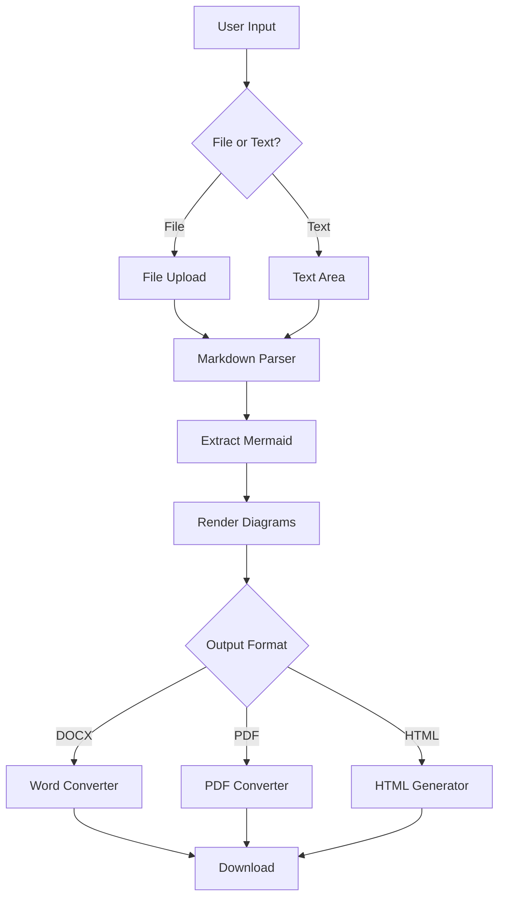
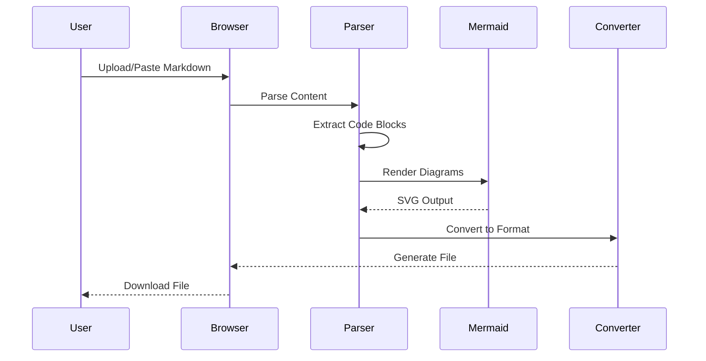
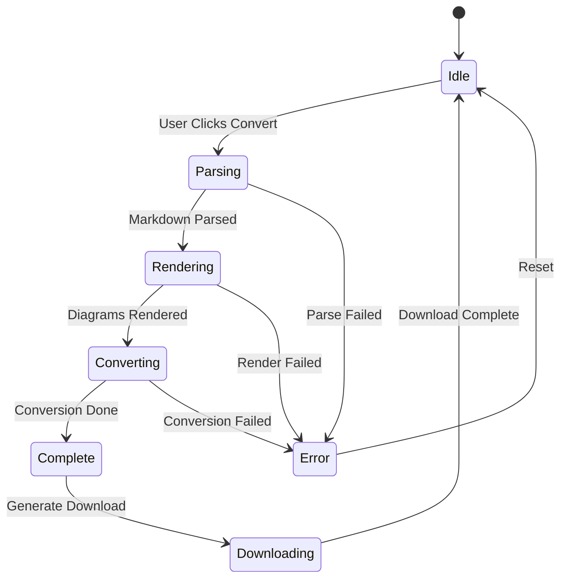
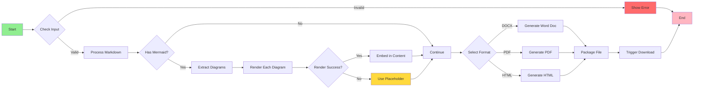
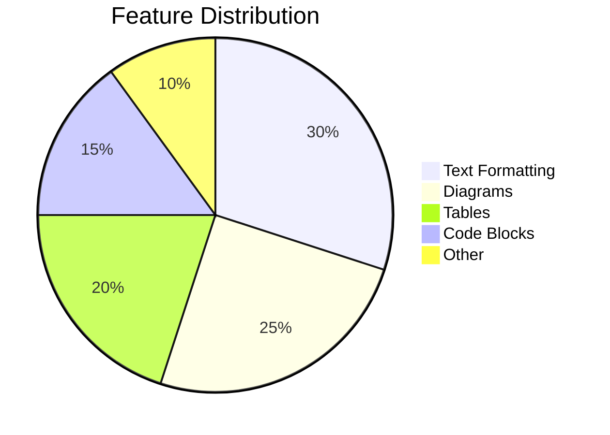

# Sample Document for Testing

## Introduction

This is a **comprehensive test document** that demonstrates all the features of the MD Converter tool. It includes various markdown elements and *Mermaid diagrams*.

## Features Overview

The converter supports:
- Headers (H1-H6)
- **Bold** and *italic* text
- `Inline code`
- Links: [GitHub](https://github.com)
- Images (when provided)

### Code Blocks

Here's a C# code example:

```csharp
public class DocumentConverter
{
    public async Task<byte[]> ConvertAsync(string markdown)
    {
        var parser = new MarkdownParser();
        var result = await parser.ParseAsync(markdown);
        return result.ToBytes();
    }
}
```

And here's some JavaScript:

```javascript
const convertDocument = async (markdown) => {
    const parser = new MarkdownParser();
    const result = await parser.parse(markdown);
    return result;
};
```

## Mermaid Diagrams

### System Architecture

This diagram shows the overall architecture of our converter:



### Sequence Diagram

Here's how the conversion process works:



### State Diagram

The document conversion lifecycle:



## Tables

Here's a comparison of supported formats:

| Format | File Extension | Supports Diagrams | File Size | Use Case |
|--------|----------------|-------------------|-----------|----------|
| DOCX   | .docx          | ✅ Yes            | Medium    | Professional documents |
| PDF    | .pdf           | ✅ Yes            | Small     | Sharing and printing |
| HTML   | .html          | ✅ Yes            | Small     | Web publishing |

### Feature Matrix

| Feature              | Supported | Notes                        |
|---------------------|-----------|------------------------------|
| Headers             | ✅        | H1-H6                        |
| Bold/Italic         | ✅        | Full support                 |
| Code Blocks         | ✅        | Syntax highlighting in HTML  |
| Tables              | ✅        | All formats                  |
| Lists               | ✅        | Ordered and unordered        |
| Mermaid Diagrams    | ✅        | All diagram types            |
| Images              | ✅        | Base64 embedded              |
| Links               | ✅        | All formats                  |

## Lists

### Ordered List

1. First item
2. Second item
3. Third item
   1. Sub-item 3.1
   2. Sub-item 3.2
4. Fourth item

### Unordered List

- Main point
- Another point
  - Sub-point
  - Another sub-point
- Final point

### Task List

- [x] Implement markdown parsing
- [x] Add Mermaid support
- [x] Create DOCX converter
- [x] Create PDF converter
- [x] Create HTML converter
- [ ] Add custom styling options
- [ ] Support for more formats

## Blockquotes

> "The best way to predict the future is to invent it."
> - Alan Kay

> This is a multi-line quote.
> It can span multiple lines
> and maintain formatting.

## Complex Flowchart

Let's create a more complex diagram:



## Pie Chart

Distribution of supported features:



## Conclusion

This document demonstrates all the features supported by the MD Converter. The tool successfully:

1. ✅ Parses markdown content
2. ✅ Renders Mermaid diagrams
3. ✅ Converts to multiple formats
4. ✅ Maintains formatting and structure
5. ✅ Works entirely in the browser

### Thank You!

Thank you for using the **MD Converter** tool. This powerful Blazor WebAssembly application makes it easy to convert your markdown documents while preserving all formatting and diagrams!

---

*Generated with MD Converter - A Blazor WebAssembly Application*
