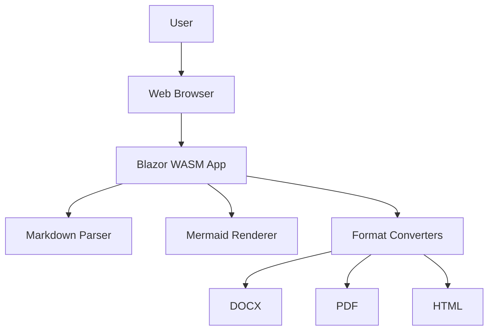

# MD Converter - Blazor WebAssembly

A powerful Markdown to Document converter built with Blazor WebAssembly that runs entirely in your browser! Perfect for AI agents to export documents directly.

## 🚀 Features

- ✅ **Convert Markdown to Multiple Formats**
  - Word Documents (DOCX)
  - PDF files
  - HTML files

- ✅ **Mermaid Diagram Support**
  - Automatically detects and renders Mermaid diagrams
  - Preserves diagrams in all output formats
  - Supports flowcharts, sequence diagrams, and more

- ✅ **Full Markdown Support**
  - Headers (H1-H6)
  - Bold, italic, and other text formatting
  - Code blocks with syntax highlighting
  - Tables
  - Lists (ordered and unordered)
  - Blockquotes
  - Links and images

- ✅ **Browser-Based Processing**
  - No server required - everything runs client-side
  - Built with .NET 9 and Blazor WebAssembly
  - Compiled to WASM for optimal performance
  - Complete privacy - your documents never leave your browser

- ✅ **AI Agent Friendly**
  - Simple file upload or paste interface
  - Direct download of converted files
  - RESTful-like interaction model

## 🛠️ Technology Stack

- **Blazor WebAssembly** - .NET 9
- **Markdig** - Advanced Markdown parsing
- **jsPDF** - Browser-based PDF generation
- **html2canvas** - HTML to image conversion
- **Open XML SDK** - Word document creation
- **Mermaid.js** - Diagram rendering
- **Bootstrap 5** - UI framework

## 📦 NuGet Packages

- `Markdig` (0.42.0) - Markdown processing
- `DocumentFormat.OpenXml` (3.3.0) - DOCX creation
- `HtmlAgilityPack` (1.12.4) - HTML parsing
- `SixLabors.ImageSharp` (3.1.11) - Image processing

## 📦 JavaScript Libraries (CDN)

- `jsPDF` (2.5.2) - PDF generation in browser
- `html2canvas` (1.4.1) - HTML to canvas rendering
- `Mermaid.js` (11.x) - Diagram rendering
- `Bootstrap Icons` (1.11.x) - UI icons

## 🏃 Getting Started

### Prerequisites

- [.NET 9 SDK](https://dotnet.microsoft.com/download/dotnet/9.0)

### Running the Application

1. Clone the repository or navigate to the project directory:
   ```bash
   cd MD-conversion-tool
   ```

2. Run the application:
   ```bash
   dotnet run
   ```

3. Open your browser and navigate to the URL shown in the terminal (typically `https://localhost:5001`)

### Building for Production

```bash
dotnet publish -c Release
```

The published files will be in `bin/Release/net9.0/publish/wwwroot/` and can be hosted on any static web server.

## 📖 Usage

### Basic Usage

1. **Upload or Paste Markdown**
   - Use the file upload button to select a `.md` file, or
   - Paste your markdown content directly into the text area

2. **Select Output Format**
   - Choose between Word (DOCX), PDF, or HTML

3. **Name Your File**
   - Enter a custom filename (without extension)

4. **Convert & Download**
   - Click the "Convert & Download" button
   - Your file will be automatically downloaded

### Mermaid Diagram Example

````markdown
# My Document

## System Architecture



The diagram above shows our architecture.
````

## 🎯 Use Cases

### For AI Agents

This tool is designed to be AI agent-friendly:

- **Direct Document Export**: AI agents can generate markdown and convert it to professional documents
- **No Backend Required**: Everything runs in the browser - no API keys or servers needed
- **Preserved Formatting**: Maintains structure, tables, code blocks, and diagrams
- **Multiple Output Formats**: Choose the best format for your needs

### For Developers

- **Documentation Export**: Convert README files to PDFs or Word documents
- **Report Generation**: Create formatted reports from markdown templates
- **Diagram Documentation**: Include Mermaid diagrams in your documentation

## 🏗️ Project Structure

```
MD-conversion-tool/
├── Models/
│   └── ConversionResult.cs      # Data models
├── Services/
│   ├── MarkdownParser.cs        # Markdown parsing and processing
│   ├── DocxConverter.cs         # Word document generation
│   ├── PdfConverter.cs          # PDF generation
│   └── MermaidService.cs        # Mermaid diagram rendering
├── Pages/
│   └── Home.razor               # Main conversion page
├── wwwroot/
│   ├── js/
│   │   └── mermaid-interop.js  # JavaScript interop for Mermaid
│   └── css/
│       └── app.css              # Custom styles
├── Program.cs                   # Application startup
└── MDConverter.csproj           # Project file
```

## 🔧 Development

### Adding New Export Formats

1. Create a new converter service in `Services/` (e.g., `RtfConverter.cs`)
2. Implement the conversion logic
3. Add the format to the `ExportFormat` enum in `Models/ConversionResult.cs`
4. Update `Home.razor` to include the new format option
5. Register the service in `Program.cs`

### Customizing Mermaid Rendering

Mermaid configuration can be adjusted in `wwwroot/js/mermaid-interop.js`:

```javascript
mermaid.initialize({ 
    startOnLoad: false,
    theme: 'default',  // Change theme: default, dark, forest, neutral
    securityLevel: 'loose',
    flowchart: { 
        useMaxWidth: true,
        htmlLabels: true 
    }
});
```

## 🌐 Deployment

### Static Hosting

This app can be deployed to any static hosting service:

- **GitHub Pages**
- **Netlify**
- **Vercel**
- **Azure Static Web Apps**
- **AWS S3 + CloudFront**

Simply upload the contents of the `publish/wwwroot/` folder.

### Example: GitHub Pages

1. Build the release version:
   ```bash
   dotnet publish -c Release
   ```

2. Copy `bin/Release/net9.0/publish/wwwroot/` to your GitHub Pages repository

3. Update `index.html` base href if deploying to a subdirectory:
   ```html
   <base href="/your-repo-name/" />
   ```

## 📝 License

This project uses:
- **QuestPDF Community License** - Free for open-source projects
- Other dependencies have their respective licenses

## 🤝 Contributing

Contributions are welcome! Areas for improvement:

- [ ] Add more export formats (RTF, ODT, etc.)
- [ ] Improve diagram rendering in DOCX/PDF
- [ ] Add custom styling options
- [ ] Support for more Markdown extensions
- [ ] Batch file conversion
- [ ] Save/load conversion presets

## 🐛 Known Issues

- SVG diagrams in DOCX may not render perfectly (OpenXML limitation)
- Large documents (>5MB) may take time to process
- Complex Mermaid diagrams might need manual adjustment

## 📞 Support

For issues, questions, or contributions, please open an issue on the repository.

---

**Built with ❤️ using Blazor WebAssembly and .NET 9**
