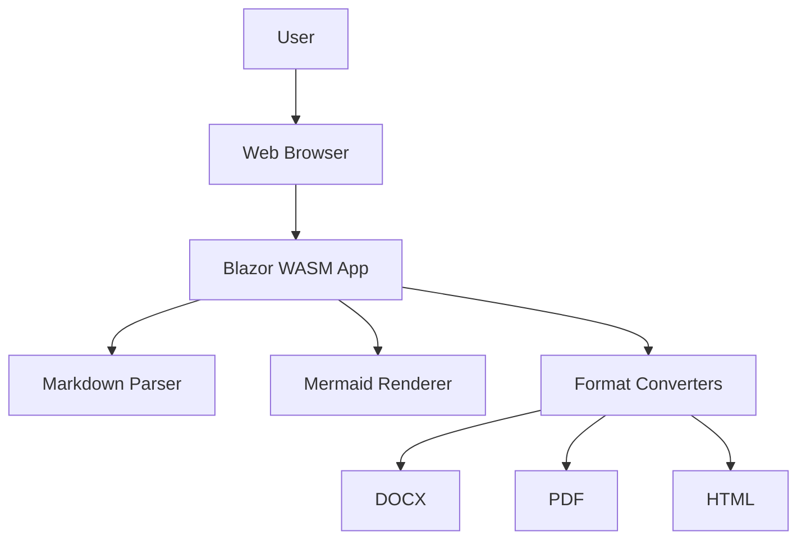

# 📄 MD Converter - Professional Markdown Document Converter

[](https://dotnet.microsoft.com/)
[](https://blazor.net/)
[](LICENSE)

A powerful, privacy-focused Markdown to Document converter built with Blazor WebAssembly that runs **entirely in your browser**! Convert Markdown files with Mermaid diagrams into professional Word documents, PDFs, or HTML with zero server dependencies.

Perfect for AI agents, developers, and anyone who needs high-quality document conversion with diagram support.

## ✨ Key Features

### 🎯 Professional Document Conversion
- **Word Documents (DOCX)** - Production-quality output using Pandoc WASM
- **PDF Generation** - Browser-based print-to-PDF with perfect formatting
- **HTML Export** - Standalone files with embedded images and diagrams

### 📊 Advanced Diagram Support
- **Mermaid.js Integration** - Full support for flowcharts, sequence diagrams, class diagrams, and more
- **SVG Processing** - Intelligent handling of SVG files and embedded SVG content
- **Image Embedding** - Automatic conversion and embedding of diagrams as PNG (DOCX/PDF) or SVG (HTML)

### 🔒 Privacy & Performance
- **100% Client-Side** - All processing happens in your browser
- **No Server Required** - Zero backend dependencies
- **WebAssembly Powered** - Near-native performance with .NET 9 WASM
- **Your Data Stays Private** - Documents never leave your device

### 🎨 Complete Markdown Support
- Headers, bold, italic, strikethrough, and all text formatting
- Code blocks with syntax highlighting
- Tables with complex layouts
- Ordered and unordered lists
- Blockquotes and horizontal rules
- Links and images (external URLs and embedded)
- Task lists and definition lists

### 🤖 AI Agent Friendly
- Simple file upload or paste interface
- Direct download of converted files
- Batch processing support
- RESTful-like interaction model

## 🚀 Quick Start

### Run Locally

```bash
# Clone the repository
git clone https://github.com/lpobjoy/MD-conversion-tool.git
cd MD-conversion-tool

# Run the application
dotnet run

# Open browser to http://localhost:5008
```

### Build for Production

```bash
# Build optimized production bundle
dotnet publish -c Release -o publish

# Deploy the contents of publish/wwwroot to any static hosting service
```

## 🛠️ Technology Stack

| Technology | Purpose | Version |
|------------|---------|---------|
| **Blazor WebAssembly** | Frontend framework | .NET 9 |
| **Pandoc WASM** | Professional document conversion | Latest |
| **Mermaid.js** | Diagram rendering | v11 |
| **Markdig** | Markdown parsing | 0.42.0 |
| **DocumentFormat.OpenXml** | DOCX generation (fallback) | 3.3.0 |
| **html2canvas** | SVG to PNG conversion | 1.4.1 |
| **Bootstrap 5** | UI framework | 5.x |
| **Bootstrap Icons** | Icons | 1.11.3 |

## � How to Use

### Quick Start Guide

1. **📁 Input Your Content**
   - Click "Upload Markdown File" to select a `.md` file, or
   - Paste your markdown content directly into the text area

2. **⚙️ Choose Conversion Mode**
   - **Pandoc WASM** (Recommended) - Professional quality using real Pandoc compiled to WebAssembly
   - **Custom Converter** - Alternative .NET-based converter

3. **📄 Select Output Format**
   - **Word (DOCX)** - For editing in Microsoft Word
   - **PDF** - Opens print dialog, choose "Save as PDF"
   - **HTML** - Standalone web page with embedded content

4. **✨ Convert & Download**
   - Click the convert button
   - Your document will be generated and downloaded automatically!

### Example: Markdown with Mermaid Diagrams

````markdown
# My Document

## System Architecture



The diagram above shows our architecture.
````

## 🎯 Use Cases

### For AI Agents

This tool is designed to be AI agent-friendly:

- **Direct Document Export**: AI agents can generate markdown and convert it to professional documents
- **No Backend Required**: Everything runs in the browser - no API keys or servers needed
- **Preserved Formatting**: Maintains structure, tables, code blocks, and diagrams
- **Multiple Output Formats**: Choose the best format for your needs

### For Developers

- **Documentation Export**: Convert README files to PDFs or Word documents
- **Report Generation**: Create formatted reports from markdown templates
- **Diagram Documentation**: Include Mermaid diagrams in your documentation

## 🏗️ Project Structure

```
MD-conversion-tool/
├── Models/
│   └── ConversionResult.cs      # Data models
├── Services/
│   ├── MarkdownParser.cs        # Markdown parsing and processing
│   ├── DocxConverter.cs         # Word document generation
│   ├── PdfConverter.cs          # PDF generation
│   └── MermaidService.cs        # Mermaid diagram rendering
├── Pages/
│   └── Home.razor               # Main conversion page
├── wwwroot/
│   ├── js/
│   │   └── mermaid-interop.js  # JavaScript interop for Mermaid
│   └── css/
│       └── app.css              # Custom styles
├── Program.cs                   # Application startup
└── MDConverter.csproj           # Project file
```

## 🔧 Development

### Adding New Export Formats

1. Create a new converter service in `Services/` (e.g., `RtfConverter.cs`)
2. Implement the conversion logic
3. Add the format to the `ExportFormat` enum in `Models/ConversionResult.cs`
4. Update `Home.razor` to include the new format option
5. Register the service in `Program.cs`

### Customizing Mermaid Rendering

Mermaid configuration can be adjusted in `wwwroot/js/mermaid-interop.js`:

```javascript
mermaid.initialize({ 
    startOnLoad: false,
    theme: 'default',  // Change theme: default, dark, forest, neutral
    securityLevel: 'loose',
    flowchart: { 
        useMaxWidth: true,
        htmlLabels: true 
    }
});
```

## 🌐 Deployment

### Static Hosting

This app can be deployed to any static hosting service:

- **GitHub Pages**
- **Netlify**
- **Vercel**
- **Azure Static Web Apps**
- **AWS S3 + CloudFront**

Simply upload the contents of the `publish/wwwroot/` folder.

### Deploy to GitHub Pages

```bash
# Build production version
dotnet publish -c Release -o publish

# The static files are in publish/wwwroot/
# Upload to GitHub Pages or any static host
```

### Deploy to Azure Static Web Apps

```bash
# Install Azure Static Web Apps CLI
npm install -g @azure/static-web-apps-cli

# Build
dotnet publish -c Release -o publish

# Deploy
swa deploy publish/wwwroot
```

## 🎨 Architecture

```
MD-conversion-tool/
├── Pages/
│   └── Home.razor          # Main UI component
├── Services/
│   ├── MarkdownParser.cs   # Markdown parsing & Mermaid extraction
│   ├── DocxConverter.cs    # Custom DOCX converter
│   ├── PandocService.cs    # Pandoc WASM integration
│   ├── MermaidService.cs   # Mermaid diagram rendering
│   └── SvgHandler.cs       # SVG processing & conversion
├── wwwroot/
│   ├── js/
│   │   ├── pandoc-interop.js    # Pandoc WASM wrapper
│   │   └── mermaid-interop.js   # Mermaid JS integration
│   └── pandoc.wasm         # 50MB Pandoc WebAssembly binary
└── Models/
    └── ConversionResult.cs # Data models
```

## 🔧 Advanced Configuration

### Mermaid Theme Customization

Edit `wwwroot/index.html` to customize Mermaid themes:

```javascript
mermaid.initialize({ 
    theme: 'default',  // Options: default, dark, forest, neutral
    themeVariables: {
        primaryColor: '#ffffff',
        primaryTextColor: '#000000'
    }
});
```

### PNG Conversion Quality

Adjust resolution in `wwwroot/js/mermaid-interop.js`:

```javascript
// Default: 1600x1200
convertSvgToPng(svg, 2400, 1800);  // Higher quality
```

## � Features Comparison

| Feature | Pandoc WASM | Custom Converter |
|---------|-------------|------------------|
| Output Quality | ⭐⭐⭐⭐⭐ | ⭐⭐⭐ |
| Processing Speed | Fast | Very Fast |
| Table Support | Excellent | Good |
| Diagram Quality | Excellent | Good |
| Complex Formatting | Excellent | Basic |
| File Size | Larger (~50MB WASM) | Smaller |

## 🐛 Troubleshooting

### Common Issues

**Issue:** "Pandoc WASM not initialized"
- **Solution:** Wait for the page to fully load, refresh if needed

**Issue:** Diagrams not showing in DOCX
- **Solution:** Ensure Mermaid syntax is correct, check browser console for errors

**Issue:** PDF generation not working
- **Solution:** Allow pop-ups in your browser for the print dialog

**Issue:** Large files timing out
- **Solution:** Split large documents or increase timeout settings

## 🤝 Contributing

Contributions welcome! Here's how:

1. Fork the repository
2. Create a feature branch (`git checkout -b feature/amazing-feature`)
3. Commit your changes (`git commit -m 'Add amazing feature'`)
4. Push to the branch (`git push origin feature/amazing-feature`)
5. Open a Pull Request

### Development Roadmap

- [ ] Batch file conversion
- [ ] Custom themes and styling
- [ ] Additional export formats (RTF, ODT)
- [ ] File upload for referenced images/SVGs
- [ ] Save/load conversion presets
- [ ] Dark mode support

## � License

This project is open source and available under the [MIT License](LICENSE).

### Third-Party Licenses

- Pandoc WASM - GPL v2
- Mermaid.js - MIT License
- Markdig - BSD 2-Clause
- Bootstrap - MIT License
- Other dependencies retain their respective licenses

## 👤 Author

**Lewis Pobjoy**

- GitHub: [@lpobjoy](https://github.com/lpobjoy)
- Repository: [MD-conversion-tool](https://github.com/lpobjoy/MD-conversion-tool)

## 🙏 Acknowledgments

- [Pandoc](https://pandoc.org/) for the amazing document converter
- [Mermaid.js](https://mermaid.js.org/) for diagram rendering
- [Blazor team](https://dotnet.microsoft.com/apps/aspnet/web-apps/blazor) for the WebAssembly framework
- The open-source community for all the amazing libraries

## 📞 Support & Feedback

- 🐛 Found a bug? [Open an issue](https://github.com/lpobjoy/MD-conversion-tool/issues)
- 💡 Have a feature request? [Start a discussion](https://github.com/lpobjoy/MD-conversion-tool/discussions)
- ⭐ Like this project? Give it a star on GitHub!

---

**Built with ❤️ using Blazor WebAssembly, .NET 9, and Pandoc WASM**
